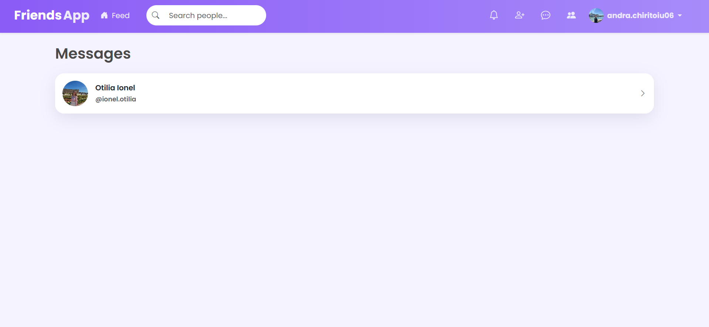
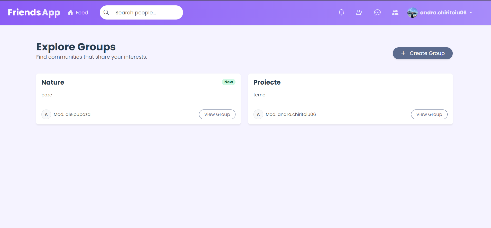
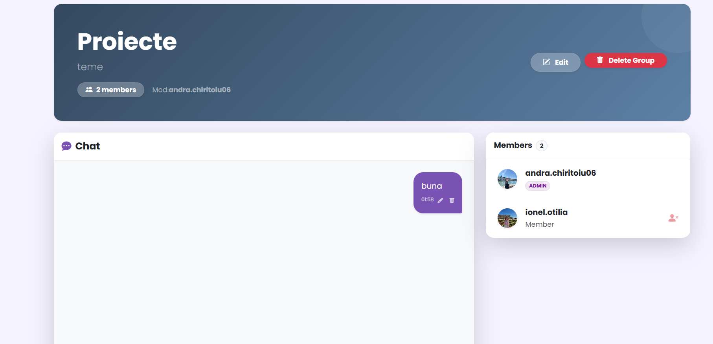
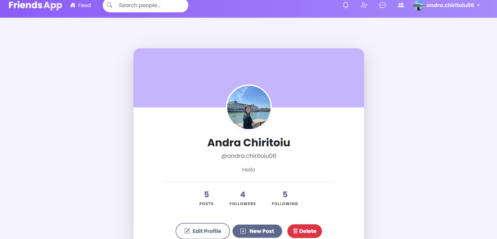
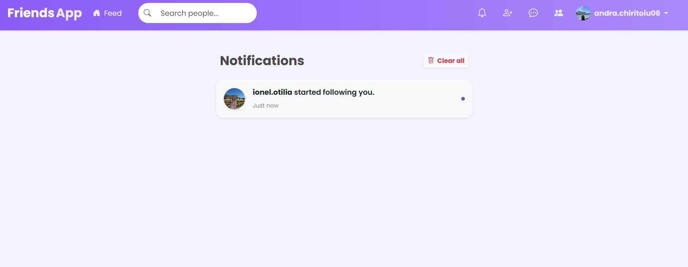
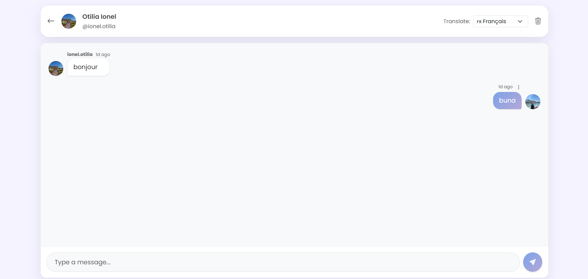

# Micro-social Platform

A web-based social networking application developed in **ASP.NET Core MVC**, designed to facilitate interaction between users through posts, groups, and a follow system.

---

## Main Features

### 👤 User Management
* **User types:** Visitor, Registered User, Administrator.
* **Authentication:** Full Login/Register system using **ASP.NET Identity**.
* **Profiles:** Ability to set profiles as **Public** or **Private**. Users can edit their name, description, and profile picture.
* **Search:** Find users by name or partial name.

### 👥 Groups and Communities
* Create new groups (the creator becomes moderator).
* **Join Request** system (members must be approved by the moderator).
* Group discussions.

### 📝 Posts and Feed
* Create posts with multimedia content (Text, Photo, Video).
* Personalized feed showing posts from followed users.
* Like and Comment system.

### 🤖 AI Component (Content Moderation)
* Integration with an AI service for automatic filtering of inappropriate content (hate speech, insults).
* Validation is performed before saving content to the database.
* The system also translates user messages into the selected language before they are stored/displayed.

---

## Technologies Used

* **Framework:** .NET 9.0 (ASP.NET Core MVC)
* **Language:** C#
* **Database:** SQL Server (via Entity Framework Core)
* **Frontend:** HTML5, CSS3, Bootstrap
* **Version Control:** Git & GitHub

---

## 📂 Project Structure

```text
Micro-social-Platform/
├── Controllers/       # Business logic (PostsController, GroupsController, etc.)
├── Models/            # Database entities (ApplicationUser, Post, Group, etc.)
├── Views/             # User interface (Razor Pages)
├── Data/              # EF Core context and migrations
├── Services/          # AI Content Moderation logic
├── wwwroot/           # Static resources (CSS, JS, uploaded images)
└── Dockerfile         # Container configuration
```


## Installation and Run (Commands)

Follow the steps below to run the project on your local machine.

### 1. Clone the repository

Open a terminal (Command Prompt, PowerShell, or Git Bash) and run:

```bash
git clone https://github.com/andrachiritoiu/Micro-social-Platform.git
```

### 2. Navigate to the project folder
```bash
cd Micro-social-Platform
```


### 3. Configure the Database and AI

Before running migrations, open the `appsettings.json` file and make the following changes:

1. Make sure the **Connection String** is correct for your SQL Server instance.
2. Add the API key for the AI moderation service (required for post validation):
   ```json
   "AISettings": {
     "ApiKey": "YOUR_API_KEY"
   }
   ```

After saving the file, run the following commands in the terminal (or Package Manager Console) to create the database and apply **Seed Data**:

```bash
dotnet tool install --global dotnet-ef
dotnet ef database update
```


### 4. Run the Application

Start the local server with the following command:

```bash
dotnet run
```

The application will be accessible in the browser at:  
`https://localhost:`

---


### 🔑 Test Accounts (Seed Data)

After applying migrations (`dotnet ef database update`), the database is automatically populated with the following test users:

* **Administrator:** `admin@test.com` / Password: `Admin1!`
* **User:** `maria.diaconescu@test.com` / Password: `User1!`
* **User:** `ioana.vlad@test.com` / Password: `User1!`
* **User:** `david.chipirnic@test.com` / Password: `User1!`

### Seeded Data Overview

The seed script creates:
- **Roles:** `Admin`, `User`
- **Users:** 1 admin + 3 regular users (with default profile image and descriptions)
- **Groups:** 3 groups (`Nature Lovers`, `Tech World`, `Travel Buddies`) with assigned moderators
- **Posts:** 3 demo posts (each with a placeholder image URL)

> Note: Moderators are automatically added as **accepted members** of their own groups (fix for the “moderator not member” issue).

  

The database includes the following main entities:
- **Users**
- **Posts**
- **Comments**
- **Reactions**
- **Follows**
- **Groups**
- **GroupMembers**
- **Messages**
- **Notifications**

Relationships are managed using **Entity Framework Core**, relying on conventions and explicit configurations where necessary.

---


## Roadmap / Tasks

### Done (MVP)
- [x] Authentication & roles (ASP.NET Identity)
- [x] Public/private profiles + profile editing
- [x] Posting (text + media) + feed
- [x] Likes and comments
- [x] Follow system + filtered feed
- [x] Groups + join requests + basic moderation
- [x] Complete UI notifications (follow, like, comment, join accepted)
- [x] Messaging: inbox + read status + pagination
- [x] Improved search (filters)
- [x] AI moderation before saving posts
- [x] UI: empty states, skeleton loading, toast messages

### In progress / Next
- (to be defined)

### Nice to have
- [ ] Feed refresh without reload (AJAX)
- [ ] Public group pages with rules and extended descriptions
- [ ] Admin dashboard (reports, content moderation, user management)
- [ ] Unit and integration tests (Controllers & Services)
- [ ] CI pipeline (GitHub Actions) + badge in README


## 🐳 Run with Docker (Alternative)

If you prefer not to install SQL Server locally, you can run the application using Docker.

### Prerequisites
* [Docker Desktop](https://www.docker.com/products/docker-desktop/) installed and running.

### Steps to run

1. **Open a terminal** in the project root (where the `docker-compose.yml` file is located).
2. **Build and start the containers:**
   ```bash
   docker-compose up --build
   ```
3. **Access the application:**
   After the logs indicate that the application has started, open your browser at:
   * **http://localhost:8080**

4. **Stop the application:**
   To stop the services, press `Ctrl+C` or run:
   ```bash
   docker-compose down
   ```

---

## Gallery

<div align="center">
  
  <br><br>
  
  <br><br>
  
  <br><br>
  
  <br><br>
  
  <br><br>
  
  <br><br>
  
  <br><br>
  
</div>
